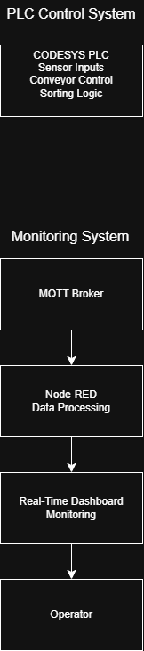
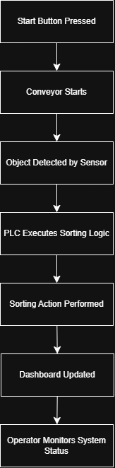
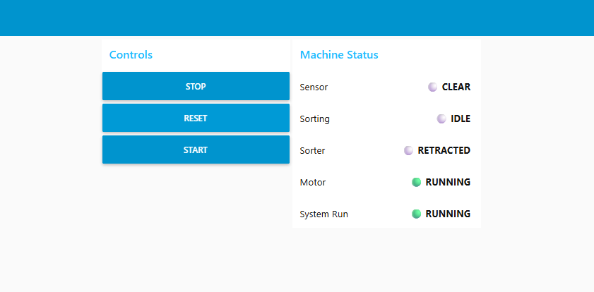
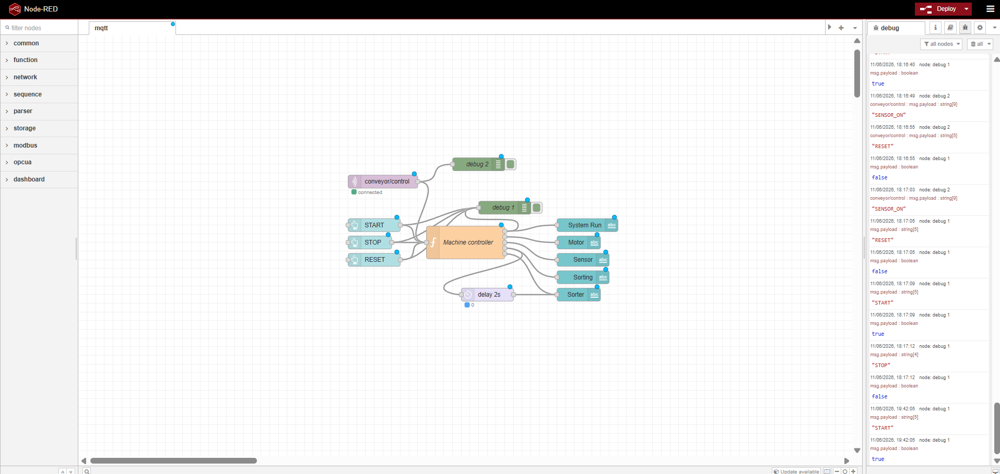
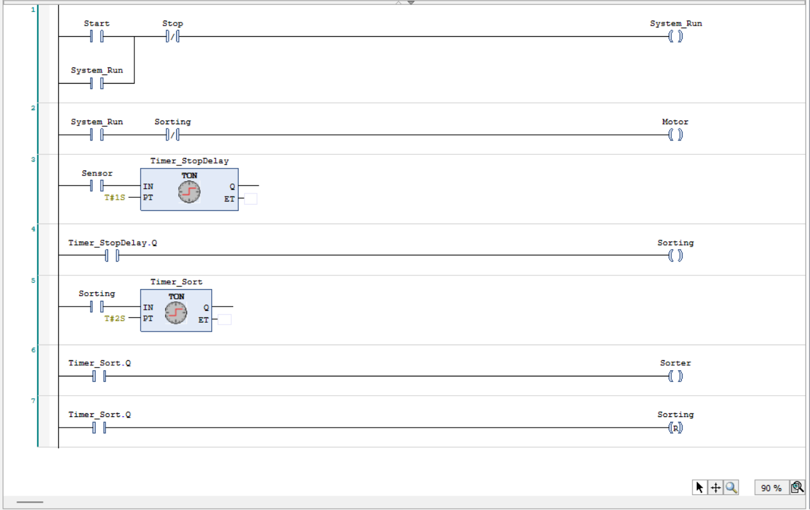
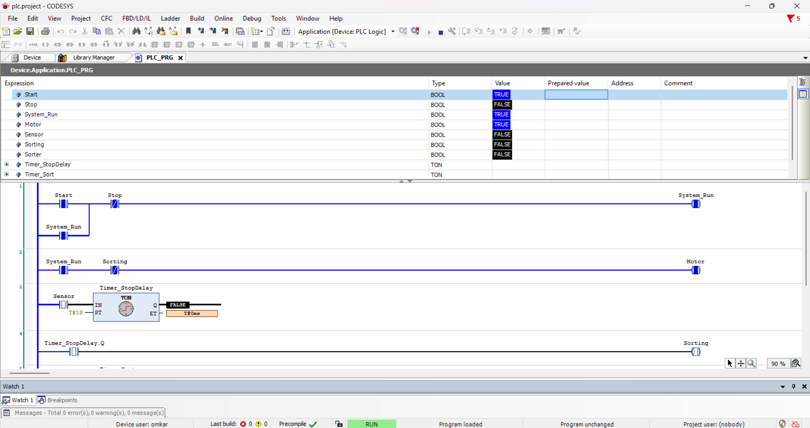

# Smart-Factory-Sorting-and-Monitoring-System
Industry 4.0 production monitoring system using CODESYS PLC, Node-RED dashboards and real-time process visualization.
# Smart Factory Sorting and Monitoring System

## Overview

This project demonstrates a simulated Smart Factory system developed using CODESYS PLC programming, Node-RED dashboards, and MQTT-based messaging concepts.

The system simulates an automated production line featuring conveyor control, sensor-based object detection, sorting logic, and real-time process monitoring. Machine states and process information are visualized through an interactive Node-RED dashboard, while MQTT topics enable real-time data updates and event monitoring.

The project showcases core Industrial Automation, Industry 4.0, and Smart Manufacturing concepts through the integration of PLC control logic and modern monitoring technologies.

---

## Features

* PLC-based conveyor control
* Start, Stop, and Reset functionality
* Sensor-based object detection
* Automated sorting logic
* Real-time machine status monitoring
* Interactive Node-RED dashboard
* MQTT message monitoring
* Event-driven status updates
* Process visualization
* Industrial automation simulation

---

## System Architecture

```text
 MQTT Topics
    │
    ▼
 Node-RED Flow
    │
    ▼
 Dashboard UI
    │
    ▼
 Operator


CODESYS PLC Simulation
        │
        ▼
 Conveyor + Sensor + Sorter
```

---

## Documentation

The repository includes editable and exported system documentation:

### Architecture Diagram

Illustrates the overall system structure, including PLC control, Node-RED monitoring, MQTT communication, and operator interaction.

Files:

* docs/Architecture_Diagram.png
* docs/Architecture_Diagram.drawio

### Workflow Diagram

Illustrates the operational sequence from system start-up through object detection, sorting, and monitoring.

Files:

* docs/Workflow_Diagram.png
* docs/Workflow_Diagram.drawio


## System Workflow

1. Operator starts the production system.
2. Conveyor operation begins.
3. Sensor detects incoming objects.
4. PLC executes sorting logic.
5. Sorting mechanism activates when conditions are met.
6. Node-RED dashboard displays machine states.
7. MQTT updates are processed and reflected in the monitoring interface.
8. Operator monitors the complete process in real time.

---

## Technologies Used

### Industrial Automation

* CODESYS V3.5
* Ladder Logic (LD)
* PLC Simulation

### Monitoring & Communication

* Node-RED
* MQTT
* Dashboard Development
* Event-Driven Processing
* Real-Time Monitoring

### Industry Concepts

* Industrial Automation
* Industry 4.0
* Smart Manufacturing
* Human Machine Interface (HMI)
* Process Monitoring
* Sensor-Based Control Systems

---

## Project Structure

```text
Smart-Factory-Sorting-and-Monitoring-System

├── codesys
│   └── SmartFactorySorting.projectarchive

├── docs
│   ├── Architecture_Diagram.png
│   ├── Architecture_Diagram.drawio
│   ├── Workflow_Diagram.png
│   └── Workflow_Diagram.drawio

├── node-red
│   └── flow.json

├── screenshots
│   ├── Dashboard.png
│   ├── NodeRED_Flow.png
│   ├── NodeRED_Flow_Detail.png
│   ├── Codesys_Ladder_Logic.png
│   ├── Codesys_Runtime.png
│   └── Codesys_Variables.png

├── videos
│   ├── 01_Codesys_Demo.mp4
│   └── 02_NodeRED_MQTT_Dashboard_Demo.mp4

└── README.md
```

---

## Demonstration

### Architecture Diagram



### Workflow Diagram



### CODESYS PLC Demonstration
Located in:
- videos/01_Codesys_PLC_Demo.mp4

The PLC demonstration shows:

* Ladder Logic execution
* Conveyor operation
* Sensor detection
* Sorting sequence
* Start/Stop/Reset functionality
* Real-time PLC simulation

### Node-RED & MQTT Demonstration
Located in:
- videos/02_NodeRED_MQTT_Dashboard_Demo.mp4

The dashboard demonstration shows:

* Node-RED flow execution
* MQTT topic monitoring
* Dashboard interaction
* Real-time status updates
* Sensor state visualization
* Sorting status indication
* Event-driven process monitoring

---

## Screenshots

### Dashboard



### Node-RED Flow



### PLC Ladder Logic



### PLC Runtime


---

 
 ## Project Outcomes

- Successfully developed a PLC-based sorting system using CODESYS.
- Implemented sensor-driven automation logic.
- Created a real-time monitoring dashboard using Node-RED.
- Demonstrated MQTT-based event updates and dashboard interaction.
- Applied Industry 4.0 and smart manufacturing concepts in a simulated production environment.


## Skills Demonstrated

* PLC Programming
* Ladder Logic Development
* Industrial Automation
* Process Control
* Node-RED Development
* MQTT Communication
* Dashboard Design
* HMI Development
* Smart Factory Systems
* Industry 4.0 Applications
* Real-Time Monitoring
* Event-Driven Architecture
* Troubleshooting and Testing
* Automation Project Development
* Technical Documentation
* System Design
* Workflow Modeling
* Draw.io

---

## Author

**Omkar Bhogi**

M.Sc. Mechatronics and Robotics Engineering

Hochschule Schmalkalden, Germany
